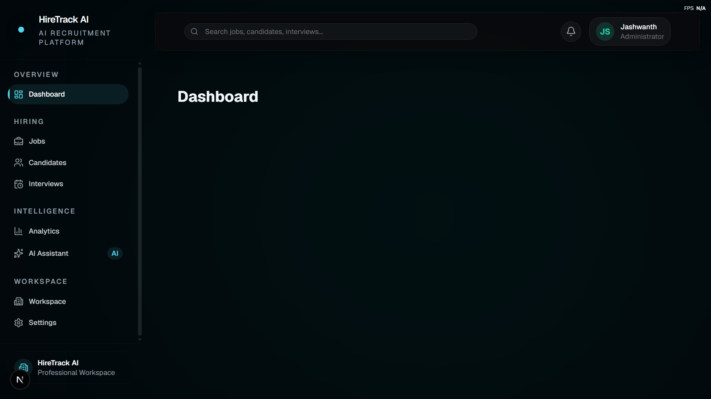

# HireTrack AI

> AI-powered Applicant Tracking System (ATS) built to help recruiters streamline hiring through intelligent resume analysis, candidate management, and AI-assisted decision making.


---

# Overview

HireTrack AI is a modern Applicant Tracking System designed for recruiters, hiring managers, and HR teams.

Unlike job portals, HireTrack AI focuses on what happens **after** candidates apply. Recruiters can manage jobs, upload resumes, organize applicants, evaluate AI-generated match scores, track hiring pipelines, and make hiring decisions from a single platform.

The project follows a documentation-first development workflow inspired by professional software engineering practices.

---

# The Problem

Recruiters often receive hundreds of resumes from platforms such as:

- LinkedIn
- Indeed
- Internshala
- Company Career Pages
- Employee Referrals

Reviewing every resume manually is repetitive, time-consuming, and increases the chance of overlooking qualified candidates.

HireTrack AI reduces this workload by helping recruiters quickly identify the strongest applicants using AI-assisted analysis.

---

# MVP Features

## Authentication

- Secure authentication with Auth.js
- Role-based access
- Company-based data isolation

## Dashboard

- Recruiter dashboard
- Hiring overview
- AI insights
- Recruitment metrics

## Job Management

- Create and manage job openings
- Store job descriptions
- Track hiring progress

## Resume Management

- Upload PDF resumes
- Resume parsing
- Candidate creation

## Candidate Management

- Candidate profiles
- Applicant pipeline
- Recruiter notes
- Hiring status management

## AI Features

- Resume parsing
- Candidate matching
- Match scoring
- Skill gap analysis
- AI hiring recommendations

## Interview Management

- Interview scheduling
- Interview feedback
- Hiring decisions

---

# Technology Stack

## Frontend

- Next.js 16
- React 19
- TypeScript
- Tailwind CSS

## Backend

- Next.js Server Actions
- Route Handlers

## Database

- PostgreSQL
- Prisma ORM
- Neon

## Authentication

- Auth.js v5

## AI

- OpenAI API *(planned)*

## Storage

- Cloud Object Storage *(planned)*

---

# Architecture

```
Recruiter

↓

Application Shell

↓

Dashboard

↓

Jobs

↓

Applications

↓

AI Analysis

↓

Interviews

↓

Hiring Decision
```

---

# Project Structure

```
app/
components/
config/
docs/
lib/
prisma/
public/
styles/
```

---

# Current Progress

## ✅ Completed

- Project Foundation
- Documentation System
- Product Architecture
- Domain Model
- Prisma Database Schema
- PostgreSQL Integration
- Authentication Foundation
- Application Shell v1

## 🚧 In Progress

- Recruiter Dashboard

## 📋 Planned

- Job Management
- Candidate Management
- Applicant Pipeline
- AI Resume Parsing
- AI Match Scoring
- Interview Management
- Analytics
- Production Deployment

---

# Roadmap

| Milestone | Status |
|------------|--------|
| Project Foundation | ✅ |
| Core Database Schema | ✅ |
| Authentication Foundation | ✅ |
| Application Shell v1 | ✅ |
| Recruiter Dashboard | 🚧 |
| Job Management | ⏳ |
| Candidate Management | ⏳ |
| AI Resume Parsing | ⏳ |
| AI Match Scoring | ⏳ |
| Interview Management | ⏳ |
| Analytics | ⏳ |
| Production Deployment | ⏳ |

---

# Screenshots

## Application Shell v1



The application shell provides the foundation for all authenticated pages. It features a modular AppShell architecture, a floating glass navbar, a configuration-driven sidebar, and a premium dark-first design system.

---

More screenshots will be added as new milestones are completed.

- Recruiter Dashboard *(Coming Soon)*
- Job Management *(Coming Soon)*
- Candidate Management *(Coming Soon)*

---

# Documentation

Project documentation is available inside the `docs/` directory.

- Architecture
- Design System
- Decisions
- Domain Model
- Requirements
- Development Plan
- Changelog
- Setup Guide
- Project Context

---

# Development Philosophy

HireTrack AI follows a **documentation-first** approach.

Every major architectural and product decision is documented before implementation begins.

Core principles include:

- Documentation is the source of truth.
- Build reusable components.
- Separate configuration from presentation.
- Prefer simplicity over unnecessary complexity.
- Build features on top of a stable application shell.

---

# Current Status

**Active Development**

The application foundation is complete.

Current development is focused on building the recruiter dashboard and core recruitment workflow.

---

# License

This project is developed for educational, portfolio, and research purposes.